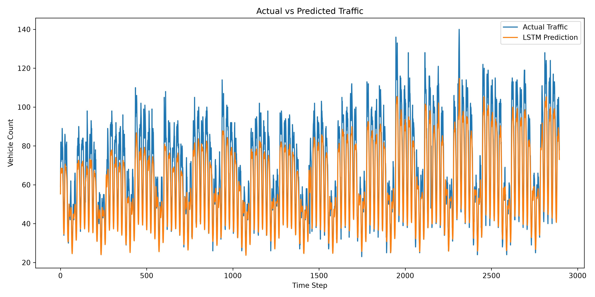
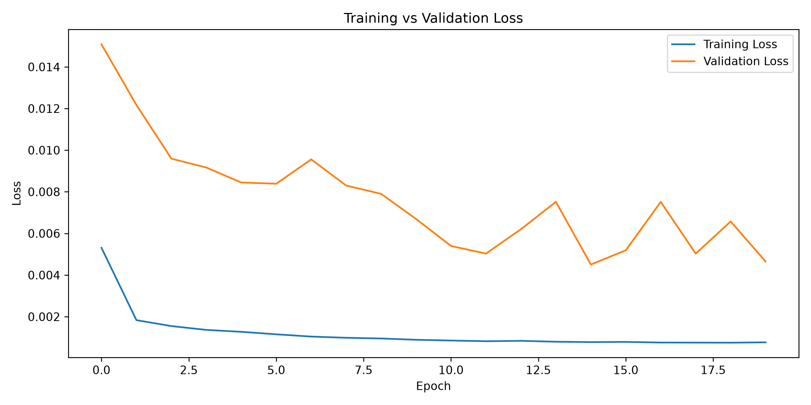

# LSTM Traffic Prediction

> **Status:** Actively developing · v2 pushed · Baseline comparison complete · Multi-junction extension planned

A time-series forecasting project using a Long Short-Term Memory (LSTM) neural network to predict hourly urban traffic volume from historical traffic patterns.

This repository is a revisit and rebuild of a model I originally developed as a first-year hackathon project.

---

## Project Background

The original project was built during a hackathon by a team of four students: three first-year students, including me, and one second-year student.

Our approach was to explore multiple machine learning and deep learning models for traffic-flow prediction. Each team member worked on a different model, with the intention of comparing different approaches to the same problem.

My contribution was the **LSTM-based traffic prediction model**.

At the time, the three first-year members primarily worked on developing their individual models and did not integrate them into a frontend. Our second-year teammate developed a more complete implementation with a functioning user interface, which became the version used for the final hackathon presentation.

My original LSTM implementation was therefore primarily a model prototype rather than a complete application.

## Why Revisit It?

More than a year later, I returned to the project to rebuild my original contribution with a better understanding of Python, machine learning workflows, time-series data, model evaluation, and software project structure.

Rather than presenting the old hackathon code as a finished project, this repository documents the process of turning that early prototype into a reproducible and properly evaluated forecasting model.

The current version includes:

- chronological train/test splitting for time-series data
- feature engineering from timestamps
- data normalization using `MinMaxScaler`
- sequence generation for LSTM input
- stacked LSTM layers with dropout
- early stopping based on validation loss
- evaluation on unseen test data using MAE, MSE, RMSE, and R²
- comparison against a naive persistence baseline
- visualization of predictions and training behaviour
- model serialization for later inference

---

## Dataset

The current implementation uses the **Traffic Prediction Dataset** published by Federico Soriano on Kaggle.

The dataset contains hourly traffic observations from multiple junctions:

| Feature | Description |
|---|---|
| `DateTime` | Timestamp of the traffic observation |
| `Junction` | Junction identifier |
| `Vehicles` | Number of vehicles observed |
| `ID` | Unique observation identifier |

The dataset is not included in this repository. Place the downloaded file at:

```text
data/traffic.csv
```

---

## Current Model

The current implementation focuses on **Junction 1** to build and validate a clear single-location forecasting pipeline before extending to multiple junctions.

For every prediction, the model receives the previous **24 hours** of observations.

Input features:

```text
Vehicles · Hour · DayOfWeek · Month
```

Target:

```text
Vehicle count for the next hour
```

LSTM input shape: `(samples, 24 timesteps, 4 features)`

### Architecture

```text
24-hour input sequence
         │
         ▼
      LSTM (64)
         │
         ▼
    Dropout (0.2)
         │
         ▼
      LSTM (32)
         │
         ▼
    Dropout (0.2)
         │
         ▼
    Dense (16, ReLU)
         │
         ▼
       Dense (1)
         │
         ▼
Next-hour vehicle prediction
```

Trained using the Adam optimizer with Mean Squared Error loss. Early stopping monitors validation loss and restores the best-performing weights.

---

## Results

### LSTM Model

```text
MAE  : 7.8180
MSE  : 100.2390
RMSE : 10.0119
R²   : 0.8210
```

### Naive Baseline (Persistence Model)

The naive baseline predicts the next hour's traffic as equal to the current hour — the simplest possible forecasting strategy.

```text
MAE  : 6.2560
MSE  : 65.5009
RMSE : 8.0933
R²   : 0.8830
```

### Interpretation

The LSTM improved significantly from v1 (R² 0.77 → 0.82), but the naive baseline currently outperforms it on every metric. This is a meaningful result — it means the model is learning temporal patterns but not yet extracting enough signal to beat a simple "predict the last value" heuristic. Beating the baseline is the next concrete target.

The prediction graph shows the model tracks daily traffic cycles well but underestimates sudden peaks — consistent with the gap in the numbers above.




---

## Project Structure

```text
lstm_traffic_prediction/
│
├── data/
│   └── traffic.csv
│
├── models/
│   └── traffic_lstm.keras
│
├── results/
│   ├── traffic_prediction.png
│   └── training_loss.png
│
├── src/
│   └── train_model.py
│
├── .gitignore
├── requirements.txt
└── README.md
```

---

## Running the Project

Create and activate a virtual environment:

```bash
python -m venv .venv
```

On Windows:

```bash
.venv\Scripts\activate
```

Install dependencies:

```bash
pip install -r requirements.txt
```

Place `traffic.csv` inside `data/` and run:

```bash
python src/train_model.py
```

The script trains the model, evaluates predictions against the naive baseline, saves the trained model, and generates result visualizations.

---

## Current Limitations

- trains on a single junction only
- vehicle count used as a proxy for traffic volume rather than physical density
- no contextual features: weather, accidents, holidays, road conditions, or events
- LSTM does not yet outperform the naive persistence baseline
- sudden traffic spikes are harder to predict accurately

## Planned Improvements

- improve model performance to beat the naive baseline
- evaluate against additional baselines (moving average, seasonal naive)
- extend pipeline to multiple junctions
- improved temporal feature engineering
- experiments with different sequence lengths and architectures
- hyperparameter tuning
- richer evaluation and visualizations
- separate inference pipeline
- possible integration with a simple API or user interface

---

## Tech Stack

`Python` · `TensorFlow / Keras` · `Pandas` · `NumPy` · `scikit-learn` · `Matplotlib`

---

## Note

This repository represents my **individual LSTM contribution and its subsequent rebuild**, not the complete application presented by the original hackathon team.

The purpose of revisiting this project is not to make the original prototype appear more complete than it was — it's to document how an early first-year experiment improves as technical understanding develops.